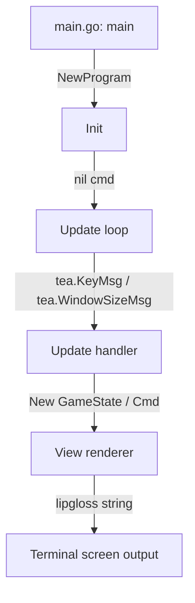

# Developer Walkthrough: Ropa-Sci Bubbletea Engine

This document provides a technical walkthrough of the Ropa-Sci Bubble Tea codebase. It explains the flow of execution, architecture, state management, and critical systems.

---

## 1. Execution Flow & Architecture

Ropa-Sci uses the Model-View-Update (MVU) architecture provided by Bubble Tea.

### Initial Entry Point
The application starts in `cmd/main.go` under the `main()` function.
- Initializes structured logging to `logs/app.log` via `models.InitLogger()`.
- Defers a panic recovery handler to clean up the terminal state and restore output buffers safely.
- Starts `tea.NewProgram` with an initial welcome model screen.

---

## 2. State Management — `models/player.go`

The `GameState` struct holds the runtime context for all screens:
- **Player Details**: Current logged-in player profile and stats.
- **Match Stats**: Round history and Wins/Losses for the current match.
- **Screen Router**: String tracking active views (`"welcome"`, `"login"`, `"register"`, `"menu"`, `"game"`, `"admin"`, etc.).
- **TUI Cursor**: Highlighted menu indexes and active form input indexes.
- **Admin lists**: Buffered list of registered player profiles loaded from JSON.

---

## 3. UI/UX Styling — `ui/styles.go`

All styling uses Lipgloss for CSS-in-terminal formatting:
- **Cyber-Neon Color Palette**: tailors a custom HSL layout (Cyber Lavender, Neon Indigo, Emerald Jade, Sunset Rose, Cyber Amber).
- **Master Centering**: The `View()` method retrieves dimensions (`TermWidth`, `TermHeight`) from window resize signals and centers the primary application container panel (`AppContainerStyle`) dynamically using `lipgloss.Place`.
- **Card layout**: Matches game selections with customized single-character key indicator boxes (e.g. `[ 1 / R ]`).

---

## 4. Key Subsystems

### Thread-Safe Persistence — `models/storage.go`
Saves and loads registered profiles to `data/players.json`.
- Uses a package-level `sync.RWMutex` to guarantee safe concurrent reads and writes, protecting the data store from corruption during parallel network updates.
- Standard validations enforce strict name length bounds and character sanitization rules in `models/validation.go`.

### Predictive AI Engine — `models/ai_engine.go`
Implements Markov Chain transition frequency matrices:
- Records sequences of the player's last selections (e.g. Rock → Paper).
- When choosing a move, it analyzes transition probabilities to predict the player's next move and counters it.
- Falls back to Cycle-bot or Random choice difficulty states seamlessly.

### LAN Multiplayer WebSocket Broker — `server/lan_server.go`
Coordinates local multiplayer.
- **Host mode**: Spins up a local TCP listener on port 8080.
- **Client mode**: Connects to the host using `DialLANServer` and registers player names.
- Uses basic WS frames (`WriteWSFrame`/`ReadWSFrame`) to serialize round states and move outcomes peer-to-peer.
