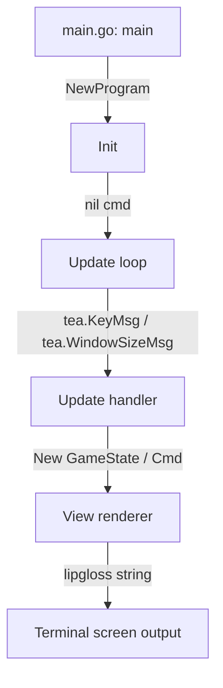

# 📖 Ropa-Sci Developer Walkthrough

Welcome to the internal engine docs for Ropa-Sci. This document breaks down the execution flow, state management, and critical subsystems of our Bubble Tea engine.

  <a href="../README.md"><kbd>← Back to Main Readme</kbd></a>

 

## 1. Execution Flow & Architecture

Ropa-Sci relies on the **Model-View-Update (MVU)** architecture provided by Bubble Tea.

### Initial Entry Point
The application boots up in `cmd/main.go` inside the `main()` function.
- It spins up structured logging to `logs/app.log` via `models.InitLogger()`.
- Defers a panic recovery handler to gracefully restore your terminal state if something crashes.
- Fires up `tea.NewProgram` and injects our initial welcome model screen.

---

## 2. State Management

The core of our app is the `GameState` struct located in `models/player.go`. It holds the runtime context for the entire application:
- **Player Details**: The currently authenticated user profile and lifetime stats.
- **Match Stats**: Round history and Wins/Losses for the active session.
- **Screen Router**: A simple string tracking active views (e.g., `"welcome"`, `"login"`, `"game"`, `"admin"`).
- **TUI Cursor**: Tracks highlighted menu indexes and active form input states.
- **Admin Buffer**: A loaded list of registered player profiles loaded dynamically from our local JSON store.

---

## 3. UI/UX Styling & Rendering

We use Lipgloss for full CSS-in-terminal formatting inside `ui/styles.go`:
- **Cyber-Neon Color Palette**: A carefully curated HSL layout featuring Cyber Lavender, Neon Indigo, Emerald Jade, Sunset Rose, and Cyber Amber.
- **Elastic Centering**: The `View()` method actively listens to terminal dimension signals (`TermWidth`, `TermHeight`) and dynamically places the primary application container panel dead center in the screen using `lipgloss.Place`.
- **Dynamic Card Layout**: Interactive game selection cards feature custom, single-character key indicator boxes (e.g. `[ 1 / R ]`).

---

## 4. Key Subsystems

### Thread-Safe Persistence
Located in `models/storage.go`, this subsystem saves and loads registered profiles to `data/players.json`.
- **Concurrency**: We use a package-level `sync.RWMutex` to guarantee safe parallel reads and writes. This strictly protects the JSON store from data corruption during parallel network updates.
- **Validation**: Enforces strict name length bounds and regex character sanitization via `models/validation.go`.

### Predictive AI Engine
The brains of the operation, located in `models/ai_engine.go`. Originally conceptualized and designed by **Michael Adejoro**, this engine uses Markov Chain transition frequency matrices.
- It actively records the sequence of the player's last selections (e.g. Rock → Paper).
- When it's the AI's turn, it analyzes those transition probabilities to predict your next move, and plays the exact counter-move.
- It seamlessly falls back to a Cycle-bot or pure Random choice if there isn't enough data yet.

### LAN Multiplayer WebSocket Broker
Located in `server/lan_server.go`, this handles local P2P multiplayer.
- **Host mode**: Spins up a local TCP listener and HTTP server on an available port.
- **Client mode**: Connects to the host using a Gorilla WebSocket dialer and registers player names.
- Uses strict JSON WS frames to serialize round states, syncing the game peer-to-peer in real-time.
